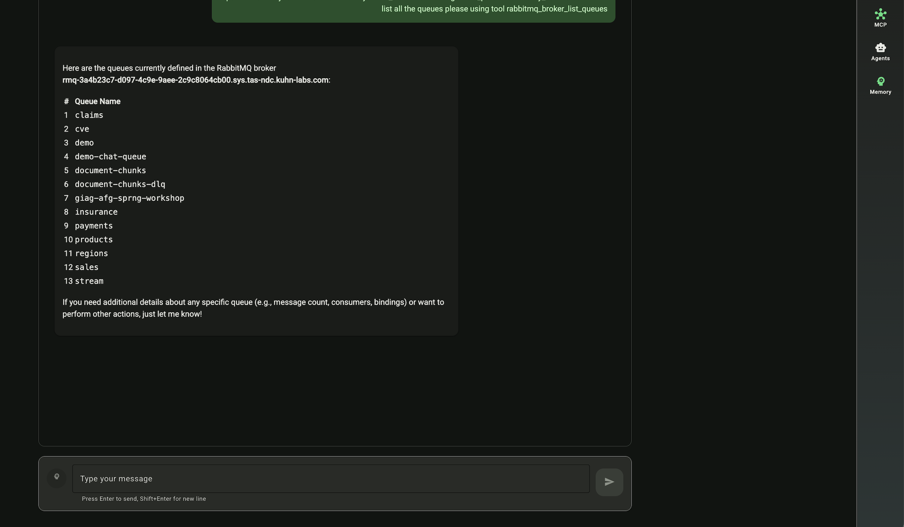

# RabbitMQ MCP Server
A [Model Context Protocol](https://www.anthropic.com/news/model-context-protocol) server implementation for RabbitMQ operation.

## Features

### Manage your RabbitMQ message brokers using AI agent
This MCP servers wraps admin APIs of a RabbitMQ broker as MCP tools.

### Connect to multiple brokers in one session
Supports connecting to multiple RabbitMQ brokers within a single session, allowing you to manage multiple clusters simultaneously.

### OAuth authentication support
Connect to RabbitMQ brokers using OAuth tokens for secure, token-based authentication.

### Supports streamable HTTP with FastMCP's `BearerAuthProvider`
You can start a remote RabbitMQ MCP server by configuring your own IdP and 3rd party authorization provider.

### Seamless integration with MCP clients
The package is available on PyPI, you can use uvx without having to fork and build the MCP server locally first.


## Installation

### PyPI

[https://pypi.org/project/amq-mcp-server-rabbitmq/](https://pypi.org/project/amq-mcp-server-rabbitmq/)

Use uvx directly in your MCP client config

```json
{
    "mcpServers": {
      "rabbitmq": {
        "command": "uvx",
        "args": [
            "amq-mcp-server-rabbitmq@latest",
            "--allow-mutative-tools"
        ]
      }
    }
}
```

### From source
1. Clone this repository.

```json
{
    "mcpServers": {
      "rabbitmq": {
        "command": "uv",
        "args": [
            "--directory",
            "/path/to/repo/mcp-server-rabbitmq",
            "run",
            "amq-mcp-server-rabbitmq",
            "--allow-mutative-tools"
        ]
      }
    }
}
```

### Configuration

#### CLI Arguments

- `--allow-mutative-tools`: Enable tools that can mutate the states of RabbitMQ. Default is false.
- `--http`: Use Streamable HTTP transport instead of stdio.
- `--server-port`: Port to run the MCP server on (default: 8888).
- `--http-auth-jwks-uri`: JWKS URI for FastMCP Bearer Auth Provider.
- `--http-auth-issuer`: Issuer for FastMCP Bearer Auth Provider.
- `--http-auth-audience`: Audience for FastMCP Bearer Auth Provider.
- `--http-auth-required-scopes`: Required scopes for FastMCP Bearer Auth Provider.

## Usage Examples

### Strands Agent Example

See [example/agent_strands](example/agent_strands) for a complete example of using the RabbitMQ MCP server with Strands AI agents.

```python
from mcp import stdio_client, StdioServerParameters
from strands import Agent
from strands.tools.mcp import MCPClient

stdio_mcp_client = MCPClient(lambda: stdio_client(
    StdioServerParameters(
        command="uvx",
        args=["amq-mcp-server-rabbitmq@latest"]
    )
))

with stdio_mcp_client:
    tools = stdio_mcp_client.list_tools_sync()
    agent = Agent(tools=tools)
    
    while True:
        user_input = input("\nYou: ").strip()
        if not user_input or user_input.lower() in ["exit", "quit"]:
            break
        agent(user_input)
```

### Amazon Q Developer CLI Example

See [example/amazon_q_cli](example/amazon_q_cli) for configuration examples with Amazon Q Developer CLI.

## Development

### Setup Development Environment

```bash
# Clone the repository
git clone https://github.com/amazon-mq/mcp-server-rabbitmq.git
cd mcp-server-rabbitmq

# Install pre-commit hooks
pre-commit install
```

### Running Tests

```bash
pytest
```

### Running it locally
```
uv run amq-mcp-server-rabbitmq --allow-mutative-tools --no-auth  --http
```



### Code Quality

This project uses ruff for linting and formatting:

```bash
# Run linter
ruff check .

# Run formatter
ruff format .
```

## License

This project is licensed under the Apache License 2.0 - see the LICENSE file for details.
